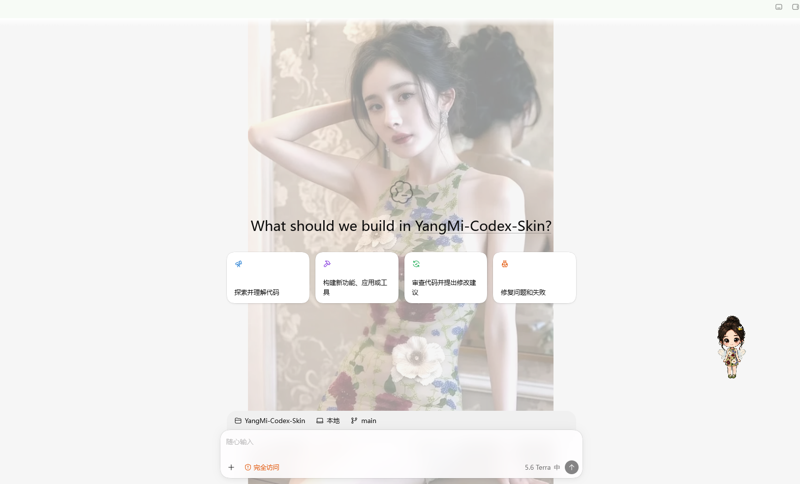

# YangMi Codex Skin

杨幂主题 Codex 皮肤与杨幂绿蜂宠物，为第一次接触 AI 的用户准备了 Windows / macOS 分步安装方式。



## 先从这里开始

| 入口 | 地址 |
| --- | --- |
| 介绍页 | [yangmi-codex-skin.pages.dev](https://yangmi-codex-skin.pages.dev/) |
| 发布版下载 | [YangMi-Codex-Skin-v1.0.0.zip](https://github.com/GoodTimeGGB/YangMi-Codex-Skin/releases/download/v1.0.0/YangMi-Codex-Skin-v1.0.0.zip) |
| 最新源码 | [下载 main 分支 ZIP](https://github.com/GoodTimeGGB/YangMi-Codex-Skin/archive/refs/heads/main.zip) |

下载后解压，不要移动解压目录中的文件。Windows 与 macOS 使用同一个压缩包，按各自系统的步骤操作即可。

## 你会得到什么

- 四套杨幂主题参考皮肤：花漾复古、白衣林间、婚纱月光、雅黑银灰。
- 可替换的自定义背景图入口。
- 杨幂绿蜂宠物：支持向左/向右拖动、悬停跳跃、等待输入与处理任务等状态。
- Windows / macOS 安装、验证与恢复脚本。
- 不修改 `WindowsApps`、`app.asar` 或 Codex 官方安装包。

## 快速安装

### Windows

1. [下载发布版压缩包](https://github.com/GoodTimeGGB/YangMi-Codex-Skin/releases/download/v1.0.0/YangMi-Codex-Skin-v1.0.0.zip) 并解压。
2. 双击 `pet-package/windows/Install-杨幂绿蜂宠物.cmd` 安装宠物。
3. 打开 `skin-package/windows/`，双击喜欢的 `Apply-*.cmd` 应用皮肤。
4. 重启 Codex，进入 `编辑 → Settings… → 宠物（Pets）`，选择 `Yang Mi Green Bee`。

### macOS

1. [下载发布版压缩包](https://github.com/GoodTimeGGB/YangMi-Codex-Skin/releases/download/v1.0.0/YangMi-Codex-Skin-v1.0.0.zip) 并解压。
2. 在“终端”进入项目根目录，执行：

```zsh
zsh pet-package/macos/install-yangmi-green-bee-pet.zsh
zsh skin-package/macos/apply-yang-mi-skin.zsh woodland-white --restart-existing
```

3. 重启 Codex，进入 `编辑 → Settings… → 宠物（Pets）`，选择 `Yang Mi Green Bee`。

> 如果 Codex 正在运行，脚本可能提示重启；请先保存正在编辑的内容。

## 宠物效果

| 向左拖动 | 向右拖动 | 悬停跳跃 | 处理任务 |
| --- | --- | --- | --- |
|  |  |  |  |

## 更换自己的背景

1. 准备一张真实的 JPEG 图片。
2. 覆盖 `skin-package/assets/custom-background/background.jpg`。
3. 再次运行一个 `Apply-*.cmd`。

图片必须是真正的 JPEG 文件；仅将 WebP 或 PNG 改名为 `.jpg` 不会生效。

## 了解更多与参与

- 介绍页包含主题参考图、完整安装说明和宠物设置引导：[yangmi-codex-skin.pages.dev](https://yangmi-codex-skin.pages.dev/)
- 项目复盘与使用指南：[YangMi-Codex-Skin-项目复盘与使用指南.md](docs/YangMi-Codex-Skin-项目复盘与使用指南.md)
- 小红书：[GoodTime](https://www.xiaohongshu.com/user/profile/5da45e7f0000000001002cc2)
- 图片投稿或其他明星皮肤定制：[提交表单](https://my.feishu.cn/share/base/form/shrcn0kDoXdfxhI3hcE8OBdmimd)

### 微信公众号：宁的AI小站


## 项目说明

这是独立的粉丝制作项目，与 OpenAI 或杨幂官方无隶属、授权或背书关系。仓库中的人物肖像与图片素材仅用于项目展示；发布、转载或二次分发前，请自行确认素材授权范围与平台规则。
