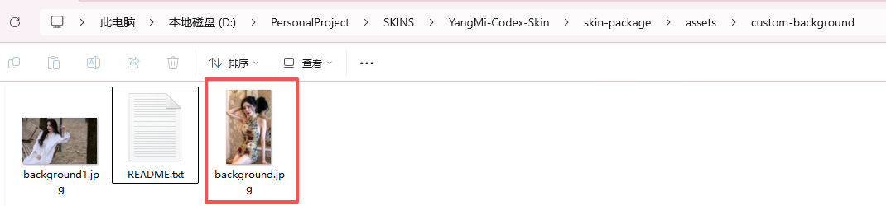
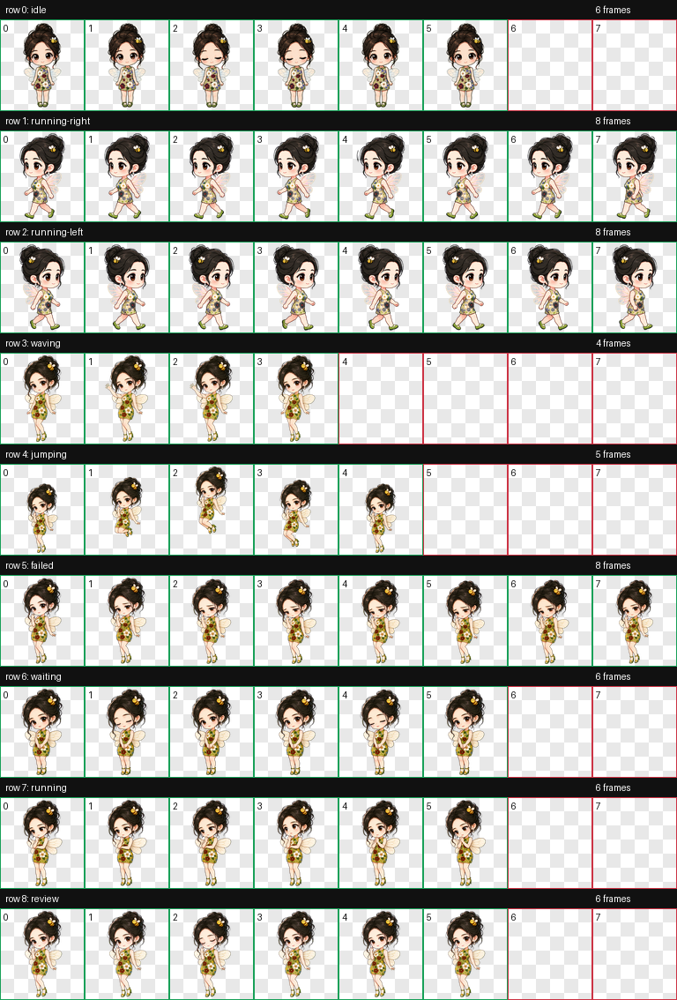
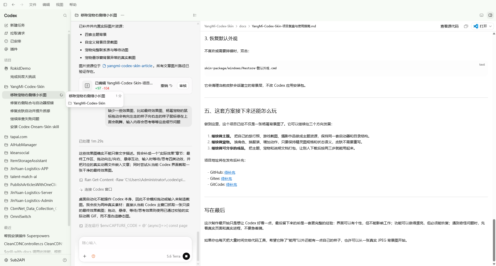
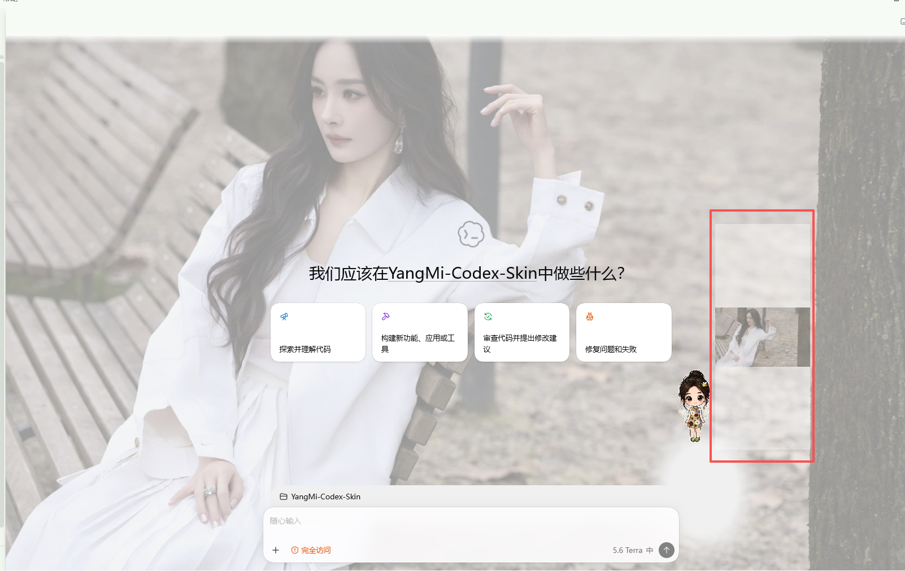

# 我给 Codex 做了一套杨幂风格皮肤，还养了一只会动的小蜜蜂

> 从一张背景图开始，到四套主题、一只动画宠物，以及一套普通人也能直接使用的本地皮肤包。

## 最新入口：先下载，再照着安装

如果你是第一次接触 AI，或只想直接使用成品，不必先读完制作过程。按下面的顺序完成即可：

1. 打开介绍页查看皮肤、宠物动效，以及 Windows / macOS 的完整安装说明：<https://yangmi-codex-skin.pages.dev/>
2. 下载项目压缩包：<https://github.com/GoodTimeGGB/YangMi-Codex-Skin/archive/refs/heads/main.zip>
3. 解压后，Windows 用户双击 `pet-package/windows/Install-杨幂绿蜂宠物.cmd` 安装宠物，再到 `skin-package/windows/` 双击喜欢的 `Apply-*.cmd` 应用皮肤；macOS 用户按介绍页中的终端命令执行。
4. 重启 Codex 后，进入 `编辑 → Settings… → 宠物（Pets）`，选择 `Yang Mi Green Bee`。

介绍页还收录了四张主题参考图、宠物向左/向右拖动、悬停跳跃、处理任务等效果预览，并提供主题图片投稿与其他明星皮肤定制入口。

项目开源仓库：<https://github.com/GoodTimeGGB/YangMi-Codex-Skin>

我每天都要在 Codex 里写代码、看报错、整理需求。它足够好用，但打开之后永远是同一种工作界面。

于是我想做一件小事：不改 Codex 的功能，不打断写代码，只把它变成一个更像“我自己的工作空间”的地方。最后，这件事没有停在换壁纸上，而是做成了一套能切换主题、能替换背景、还能带着动画宠物一起使用的皮肤包。

这篇文章不讲高深原理，主要记录我是怎么一步步把它做出来的，以及中间踩过哪些很真实的坑。读到最后，你可以直接照着把它用到自己的 Codex 上。

---

## 一、先说说我想做成什么样

一开始我给自己定了三个要求：

1. **好看，但不能抢工作。** 背景只负责氛围，输入框、按钮、编辑器还是 Codex 原来的样子。
2. **能换。** 不想把图片写死在代码里，之后换一张自己的图就应该能生效。
3. **能收回。** 不去改 `WindowsApps` 或 `app.asar`，不喜欢时可以恢复默认外观。

所以最后的方案没有去碰应用安装包，而是在当前 Codex 会话中加了一层不可交互的背景。它只监听本机回环地址的调试端口，不会替换原生按钮，也不会盖住编辑器。

皮肤一共做了四套主题。下面不是效果图占位，而是项目中实际使用的主题背景：

| 花漾复古 | 白衣林间 |
| --- | --- |
|  |  |

| 婚纱月光 | 雅黑银灰 |
| --- | --- |
|  |  |

我没有把四套主题做成四个完全不同的界面，而是让它们共享同一套工作区结构，只替换颜色和背景。这样切换时不会重新学习界面，项目维护起来也简单很多。

---

## 二、核心流程：从一张图到一套可切换皮肤

真正做起来，流程没有想象中复杂，可以拆成四步。

### 步骤 1：先把主题资源放好

每个主题都有自己的背景图和配色，统一放在 `skin-package/assets/themes`。主题名称、颜色和资源路径放在 `skin-package/themes.json`，启动器只认这里定义的四个主题：花漾复古、白衣林间、婚纱月光、雅黑银灰。

这样做的好处是，图片替换、颜色调整和主题切换都有明确入口，不需要去修改一大段注入代码。

### 步骤 2：给用户留一个“直接换图”的位置

我专门留了一个目录：

```text
skin-package/assets/custom-background/
```

只要里面存在 `background.jpg`，它就会优先覆盖主题自带的背景。用户不必理解主题配置，也不必改 JavaScript，只要准备好一张图片即可。



这里有一个必须强调的小细节：`background.jpg` 必须是**真实 JPEG 文件**。WebP 或 PNG 只改后缀为 `.jpg` 不行，程序会校验图片结构并拒绝加载。这个坑我自己就踩过，后面会专门讲。

### 步骤 3：做一只不是“静态贴纸”的宠物

皮肤完成后，我觉得右下角还缺一点陪伴感，于是做了这只杨幂风格的绿色小蜜蜂宠物。

它不是放一张 PNG 就结束了。为了让宠物能跟随 Codex 状态变化，我准备了待机、左右奔跑、挥手、跳跃、等待、失败、运行和审查等动作，再把每一组动作整理成同一尺寸、同一基线的透明帧。

最终的宠物联系表如下。每个小格都是程序会用到的真实动画帧：



实际播放时，它不是一张大图，而是根据状态从精灵图中取出对应的小格。下面是等待状态的预览：


### 步骤 4：把“皮肤”和“宠物”分开安装

这里我刻意做了分离：

- **皮肤**负责工作区背景和颜色，通过 `Apply-*.cmd` 应用。
- **宠物**由精灵图和 `pet.json` 单独打包，安装为 Codex 自定义宠物。

这样做以后，换皮肤不会把宠物弄丢，换宠物也不必重做背景。对用户来说只是两个独立选择，对项目来说则少了很多耦合。

---

## 三、实际效果：它不只是站在右下角

皮肤和宠物分别装好之后，打开 Codex 的第一眼是这样的：工作区仍然是熟悉的布局，背景只负责烘托氛围；宠物则作为独立的悬浮小窗口待在界面上，不会把输入框和编辑区盖住。



下面这张图单独截的是宠物悬浮窗口。截图工具会把透明区域显示成黑色，实际使用时这里是透明的；右下角的“正在思考”就是它在任务执行中的状态提示。


### 1. 拖动宠物时，方向不是乱的

拖动不是把宠物图层硬拽过去。向左移动时使用左向奔跑帧，向右移动时切换到右向奔跑帧，所以动作方向能和移动方向对上。

| 向左拖动 | 向右拖动 |
| --- | --- |
|  |  |

### 2. 停在宠物上面，它会给一点回应

悬停互动用的是跳跃和挥手两组帧。前者更像是俏皮地跳一下，后者是抬手打招呼；它们都来自同一张精灵图，因此尺寸、服装和轮廓不会在切换时突变。

| 悬停跳跃 | 悬停挥手 |
| --- | --- |
|  |  |

### 3. 输入和执行任务时，它也有自己的节奏

这里没有把“输入一个字”简单等同于某个动画，而是按任务状态切换：开始执行任务时使用运行/处理中状态；需要用户继续输入、批准或补充信息时使用等待状态。这样看起来像是在思考，也能让人一眼分辨当前是“它在处理”还是“轮到我继续说”。

| 执行任务中 | 等待用户输入 |
| --- | --- |
|  |  |

这部分看起来是小细节，但正是它让宠物从一张“摆在右下角的图”，变成了能跟随工作节奏的陪伴角色。

---

## 四、最花时间的不是制作，而是解决“看起来很奇怪”的问题

做完第一版时，界面已经能跑起来，但真正的难题才刚开始。下面几个问题，如果不记录下来，后来的人很容易再踩一遍。

### 1. 宠物旁边为什么跟着一条缩小的背景图？

最开始我以为是宠物精灵图裁切错了。截图里看上去，宠物右边跟着一条缩小的长图，很像一张没有处理干净的素材。



后来直接检查页面结构才发现，问题不在宠物。Codex 的宠物运行在一个独立的 `avatar-overlay` 悬浮窗口里，而皮肤注入器当时把背景层同时注入了主工作区和这个悬浮窗口。于是原本完整的背景，在小窗口里又被缩放了一遍。

修复很明确：皮肤只注入主工作区；如果宠物悬浮窗里残留了旧皮肤层，就主动清掉。宠物资源本身没有被改动。

这个问题让我明白了一件事：同一个应用里有多个窗口时，不能因为它们都叫 `app://` 就把它们当成同一个页面。

### 2. 为什么修好了，旧图又自己回来了？

第二个问题更隐蔽。页面上明明只剩一个背景层，但过几秒旧图又出现了。

原因是同时运行了两个注入器：一个来自当前项目目录，另一个来自旧副本。它们轮流把自己的 CSS 写回页面，谁都没有真正赢。

最后的处理没有直接“按进程名全杀”，而是先核对路径、主题、端口和浏览器 ID，确认属于旧皮肤包后再停止。这样做麻烦一点，却避免误结束其他工作进程。

### 3. 为什么双击 Apply 后，背景还是没变？

这一次不是代码问题，而是文件格式问题。我把一张 WebP 图改名为 `background.jpg`，肉眼看不出来，文件资源管理器也显示成 JPG，但启动器会读取实际文件结构，最终提示：

```text
Invalid JPEG structure
```

正确做法不是改后缀，而是转换格式。现在项目会保留原始 WebP，同时生成真正的 `background.jpg`。这样用户换图时也有明确规则：文件名固定，文件格式也必须对。

### 4. 为什么启动器宁愿报错，也不直接接管？

启动器会记录监控器和注入器的身份信息。如果它发现当前进程的路径或参数和记录不一致，就会提示 `watcher identity mismatch`，而不是贸然结束进程。

刚开始这很像“麻烦制造者”，后来我反而觉得它是必要保护。换皮肤不应该以牺牲正在进行的工作为代价。身份对不上，就先停下来确认，而不是猜。

---

## 五、普通用户怎么直接用？

如果你只想使用成品，不关心上面的制作过程，照下面做就够了。

### 1. 选择主题

打开目录：

```text
skin-package/windows/
```

双击你想用的主题：

```text
Apply-花漾复古.cmd
Apply-白衣林间.cmd
Apply-婚纱月光.cmd
Apply-雅黑银灰.cmd
```

如果 Codex 已经运行，但启动器提示需要重启，先保存当前草稿，再按提示操作。

### 2. 换成自己的背景

1. 准备一张真实的 JPEG 图片。
2. 放进 `skin-package/assets/custom-background/`。
3. 文件名改为 `background.jpg`。
4. 再双击一次想使用的 `Apply-*.cmd`。

背景会完整显示在右侧工作区，不强行裁切。你可以保留原图的 WebP 或 PNG 文件，但真正被读取的是 JPEG 格式的 `background.jpg`。

### 3. 恢复默认外观

不喜欢或需要排错时，双击：

```text
skin-package/windows/Restore-默认外观.cmd
```

它会清理当前皮肤会话建立的背景层，不改 Codex 应用安装包。

---

## 六、这套方案接下来还能怎么玩

做到这里，这个项目已经不仅是一张杨幂背景图了。它可以继续往三个方向发展：

1. **继续做主题。** 把自己的旅行照、游戏截图、摄影作品做成主题资源，保持同一套启动器和目录结构。
2. **继续做宠物。** 换角色、换服装、增加动作，只要保持精灵图规格和状态语义，皮肤不需要重写。
3. **继续做可分享的成品。** 把主题、宠物和说明文档打包，让别人下载后按两三步就能用起来。

项目入口：

- 介绍页：[yangmi-codex-skin.pages.dev](https://yangmi-codex-skin.pages.dev/)
- 直接下载：[项目压缩包（ZIP）](https://github.com/GoodTimeGGB/YangMi-Codex-Skin/archive/refs/heads/main.zip)
- GitHub：[GoodTimeGGB/YangMi-Codex-Skin](https://github.com/GoodTimeGGB/YangMi-Codex-Skin)

---

## 写在最后

这次制作最开始只是想让 Codex 好看一点，最后留下来的却是一套更完整的经验：界面可以有个性，但不能影响工作；功能可以做得漂亮，但必须能恢复；遇到奇怪问题时，先看真实页面和真实进程，不要急着猜。

如果你也每天把大量时间交给代码工具，希望它除了“能用”以外还能有一点自己的样子，也许可以从一张真实 JPEG 背景图开始。
